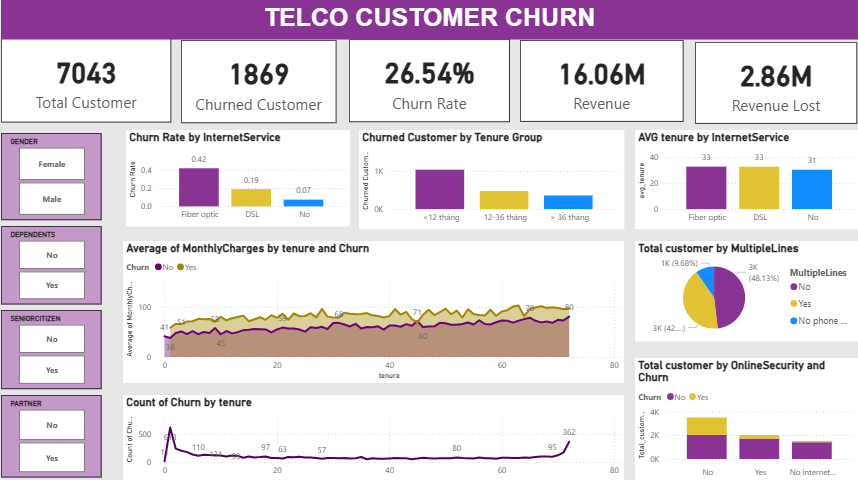
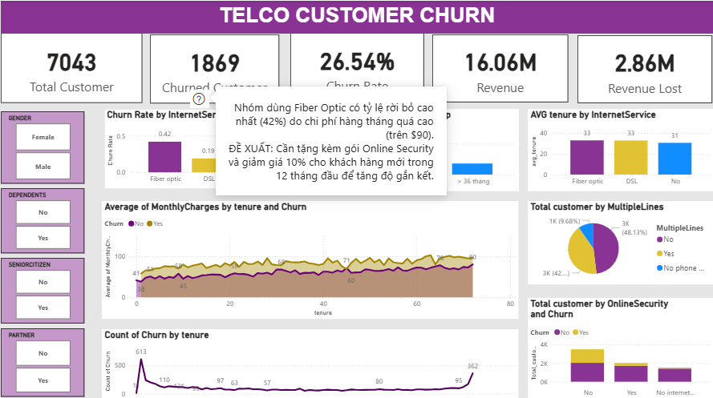
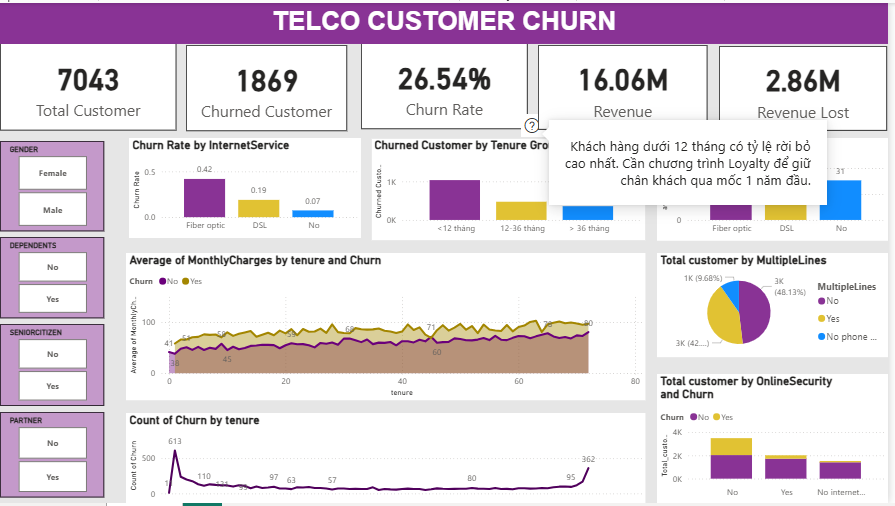
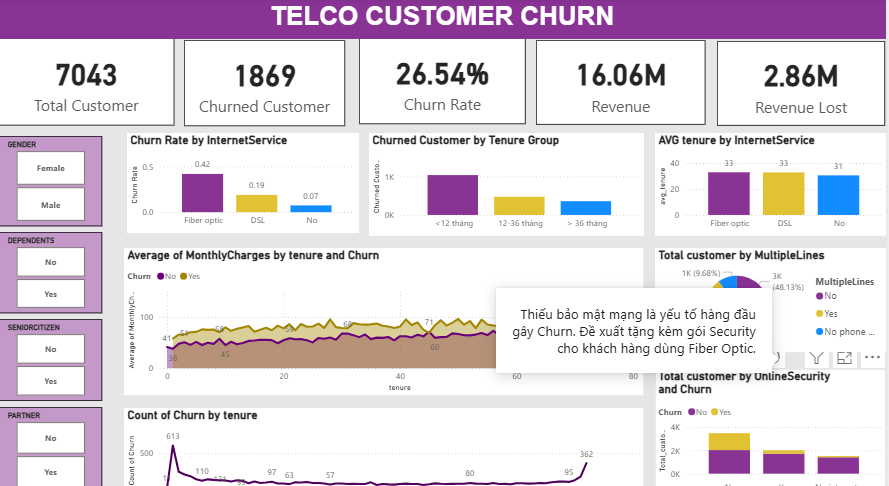

# 📡 Telecom Customer Churn Analysis & Power BI Dashboard

## 📌 Project Overview
In this project, I acted as a **Data Analyst at a telecommunications company** to solve a critical business challenge: customer attrition (churn). Utilizing an **End-to-End Power BI workflow**, I analyzed the *Telco Customer Churn* dataset to pinpoint the core driving factors behind customer turnover. 

The final deliverable is an insights-driven dashboard designed to help stakeholders implement proactive, service-specific retention strategies focusing on phone, internet, and security features.

---

## 🎯 Objectives & Business Scenario
As a Telecom Data Analyst, the project was executed based on the following structural mandates:
* **Business Mandate:** Identify why customers are leaving (churning) and propose strategic retention paths based on service lines (Phone, Internet, and Security).
* **Data Wrangling inside BI:** Ingest the raw CSV dataset, perform thorough data cleansing, handle missing values, and engineer categorical groups directly using **Power Query**.
* **Advanced Data Modeling:** Utilize **DAX (Data Analysis Expressions)** to calculate dynamic business metrics and customer KPIs.
* **Interactive UI/UX Design:** Create an intuitive dashboard using **Report Page Tooltips (`?` icons)** to embed localized analytical insights and recommendations directly over the charts, ensuring a clean and data-rich user experience.

---

## 📂 Dataset Specification
* **Source:** Telco Customer Churn Dataset (7,043 customer records).
* **Key Attributes Analyzed:**
  * **Demographics:** CustomerID, Gender, SeniorCitizen, Partner, Dependents.
  * **Services Subscribed:** PhoneService, InternetService (DSL/Fiber Optic), OnlineSecurity, OnlineBackup, TechSupport, MultipleLines.
  * **Account Contracts:** Tenure, Contract Type, PaperlessBilling, PaymentMethod, MonthlyCharges, TotalCharges.
  * **Target Variable:** Churn (Yes/No).

---

## 🧹 Data Transformation & Modeling (Power Query & DAX)
The data was fully prepared and modeled using native Power BI engines to satisfy the analytical requirements:

### 1. Data Cleaning & ETL (Power Query):
* Handled missing values and replaced erroneous blank strings in `TotalCharges`.
* Converted `SeniorCitizen` indicators into a clean, categorical `Yes/No` format.
* Profiled data to remove any duplicate records based on `CustomerID`.
* **Conditional Logic & Feature Engineering:**
  * Created `Tenure Group` buckets (`< 12 tháng`, `12-36 tháng`, and `> 36 tháng`).
  * Engineered a `Total Services` column to count the number of active subscriptions per user.

### 2. DAX Calculations & Key Metrics:
Developed robust DAX measures to calculate dynamic business insights:
* `Total Customer` = `COUNT(Customer[CustomerID])` *(Result: 7,043)*
* `Churned Customer` = `CALCULATE(COUNT(Customer[CustomerID]), Customer[Churn] = "Yes")` *(Result: 1,869)*
* `Churn Rate` = `DIVIDE([Churned Customer], [Total Customer], 0)` *(Result: 26.54%)*
* Total Revenue ($16.06M) and Revenue Lost ($2.86M) to measure the financial impact of churn.

---

## 📊 Visualizations & Advanced UI/UX Features
The dashboard layout directly addresses the visualization mandates using an interactive grid:
* **Core Visuals Implemented:** Bar charts analyzing Churn Rate by `InternetService`, Column charts tracking Churn across `Tenure Group`, and distribution break-downs for `MultipleLines` and `OnlineSecurity`.
* **Interactive Slicers:** Fully filterable by `Gender`, `Dependents`, `SeniorCitizen`, and `Partner`.

### 💡 Interactive "Insight Icons" (`?` Tooltips)
To maximize data density without overcrowding the dashboard, I implemented custom **Report Page Tooltips mapped to help icons (`?`)**. Hovering over the icons instantly reveals specific deep-dive commentary and strategic actions:

#### 1. Internet Service Insight Tooltip
* **Observation:** The Fiber Optic user segment experiences an exceptionally high churn rate of **42%**, driven primarily by high monthly subscription fees (over $90/month).
* **Recommendation:** Bundle a complimentary **Online Security** package and introduce a **10% discount** targeted at new customers during their first 12 months to increase product stickiness.

#### 2. Tenure Group Insight Tooltip
* **Observation:** Customers with a tenure of **under 12 months** represent the highest attrition cohort.
* **Recommendation:** Launch an aggressive **Loyalty Program** focused on customer success to successfully bridge new sign-ups past their critical 1-year milestone.

#### 3. Online Security Insight Tooltip
* **Observation:** The **lack of internet security options** is the leading operational driver triggering customer churn.
* **Recommendation:** Proactively offer bundled **Security upgrades** to current high-risk Fiber Optic subscribers.

---

## 🖼️ Dashboard Preview

### Main Dashboard Overview


### Interactive Tooltip Demonstration (`?` Hover)


 
---

## 🚀 Final Strategic Summary
By aligning data processing with a rigorous role-play analysis framework, this project provides a clear roadmap for retention:
1. **Target the Onboarding Phase:** Prioritize customer experience and promotional pricing for accounts in their first year (`< 12 tháng`).
2. **Value-Added Service Bundling:** Position `OnlineSecurity` not as an optional add-on, but as a core retention tool wrapped into high-tier internet lines (Fiber Optic) to safeguard revenue and reduce the $2.86M financial leak.
---
## 🛠️ Tools & Technologies
* Core Platform: Power BI Desktop
* Data Transformation: Power Query (M Language)
* Analytical Modeling: DAX (Data Analysis Expressions)
* Version Control: Git / GitHub

---

## 🗂️ Project Structure
```text
telecom-customer-churn-powerbi/
│
├── data/
│   └── Telco-Customer-Churn.csv             # Raw dataset
│
├── powerBI/
│   └── telecom_churn_analysis.pbix          # Master Power BI File (ETL + Model + Visuals)
│
├── dashboard/
│   ├── dashboard.png                        # Screenshot of the main dashboard
│   ├── dashboard_tooltip_preview.png        # Screenshot of Internet/Tenure tooltip hover
│   └── dashboard_tooltip_preview2.png       # Screenshot of Security tooltip hover
│   └── dashboard_tooltip_preview3.png       # Screenshot 
└── README.md                                # Project documentation
